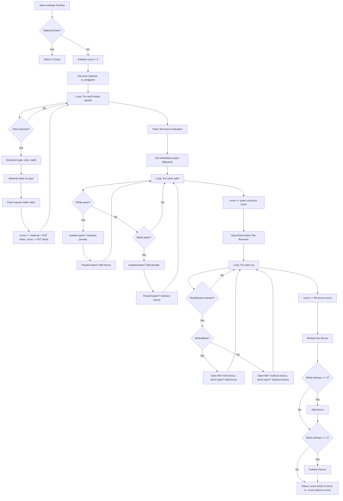

# Evaluation Function Flow Chart

---

**How to view this flow chart:**

- The file uses [Mermaid](https://mermaid-js.github.io/) syntax, which is supported by many Markdown viewers and editors.
- **Best options:**
  - **VS Code**: Install the "Markdown Preview Mermaid Support" extension, then open the file and use the built-in Markdown preview (Ctrl+Shift+V).
  - **GitHub**: Paste the content into a GitHub README or Gist—GitHub renders Mermaid diagrams natively.
  - **Mermaid Live Editor**: Copy and paste the code into [Mermaid Live Editor](https://mermaid.live/).
  - **Obsidian**: Supports Mermaid diagrams out of the box.

You can also use any Markdown tool that supports Mermaid diagrams for best results.
