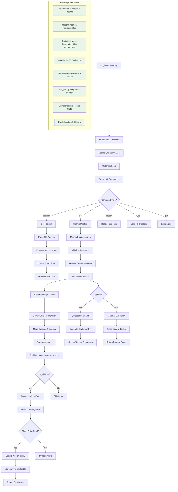
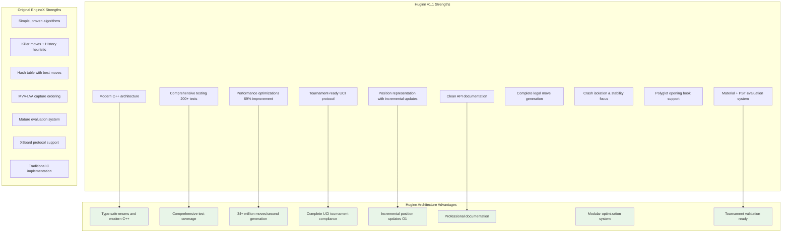

# Huginn Chess Engine - UML Architecture Diagram

```mermaid
classDiagram
    %% Core Data Structures
    class Position {
        +array~Piece,120~ board
        +Color side_to_move
        +int ep_square
        +uint8_t castling_rights
        +uint16_t halfmove_clock
        +uint16_t fullmove_number
        +array~int,2~ king_sq
        +array~uint64_t,2~ pawns_bb
        +uint64_t all_pawns_bb
        +PieceList pList[2]
        +array~array~int,7~,2~ pCount
        +array~int,2~ material_score
        +uint64_t zobrist_key
        +vector~S_UNDO~ move_history
        +int ply
        +make_move_with_undo(S_MOVE)
        +undo_move()
        +set_from_fen(string)
        +to_fen()
        +rebuild_counts()
        +at(int)
        +set(int,Piece)
    }

    class S_MOVE {
        +int move
        +int score
        +get_from() int
        +get_to() int
        +get_captured() PieceType
        +get_promoted() PieceType
        +is_capture() bool
        +is_promotion() bool
        +is_castle() bool
        +is_en_passant() bool
        +is_pawn_start() bool
        +encode_move() int
    }

    class S_MOVELIST {
        +S_MOVE moves[256]
        +int count
        +add_quiet_move(S_MOVE)
        +add_capture_move(S_MOVE,Position)
        +add_en_passant_move(S_MOVE)
        +add_promotion_move(S_MOVE)
        +add_castle_move(S_MOVE)
        +sort_by_score()
        +clear()
        +size()
    }

    class S_UNDO {
        +S_MOVE move
        +uint8_t castling_rights
        +int ep_square
        +uint16_t halfmove_clock
        +uint64_t zobrist_key
        +Piece captured
        +array~int,2~ king_sq_backup
        +array~uint64_t,2~ pawns_bb_backup
        +array~int,7~ piece_counts_backup
        +array~int,2~ material_score_backup
    }

    class SearchInfo {
        +chrono start_time
        +chrono stop_time
        +int depth
        +int max_depth
        +int ply
        +int movestogo
        +bool infinite
        +bool quit
        +bool stopped
        +bool depth_only
        +uint64_t nodes
        +S_MOVE best_move
        +uint64_t fh
        +uint64_t fhf
        +uint64_t null_cut
    }

    class MinimalLimits {
        +int max_depth
        +int max_time_ms
        +bool infinite
    }

    class TranspositionTable {
        +probe(uint64_t) bool
        +store(uint64_t,S_MOVE,int,int,int)
        +clear()
        +get_hashfull() int
    }

    class PVTable {
        +get_pv_line(Position&,int) int
        +store_pv_move(Position&,S_MOVE)
        +probe_pv_table(Position&) S_MOVE
    }

    %% Core Engine Modules
    class Main {
        +main()
        +UCIInterface()
    }

    class Position_Module {
        +set_from_fen()
        +to_fen()
        +make_move_with_undo()
        +undo_move()
        +rebuild_counts()
        +update_derived_state()
        +save_derived_state()
        +restore_derived_state()
    }

    class MoveGen_Module {
        +generate_all_moves()
        +generate_legal_moves_enhanced()
        +generate_pawn_moves()
        +generate_knight_moves()
        +generate_sliding_moves()
        +generate_king_moves()
        +generate_castling_moves()
    }

    class MinimalEngine {
        +bool should_stop
        +int nodes_searched
        +MinimalLimits current_limits
        +PVTable pv_table
        +TranspositionTable tt_table
        +PolyglotBook opening_book
        +int search_history[13][120]
        +S_MOVE search_killers[64][2]
        +int mvv_lva_scores[7][7]
        +search(Position&,MinimalLimits) S_MOVE
        +evaluate(Position&) int
        +alpha_beta(Position&,int,int,int,SearchInfo&) int
        +quiescence(Position&,int,int,SearchInfo&) int
        +clear_search_tables()
        +init_mvv_lva()
        +MaterialDraw(Position&) bool
        +mirrorBoard(Position&) Position
    }

    class Search_Module {
        +SearchPosition()
        +AlphaBeta()
        +Quiescence()
        +CheckUp()
        +PickNextMove()
        +IsRepetition()
        +ClearForSearch()
        +GetTimeMs()
        +InitMvvLva()
    }

    class Evaluate_Module {
        +evaluate(Position&) int
        +material_evaluation() int
        +piece_square_tables() int
        +pawn_structure() int
        +king_safety() int
        +get_game_phase() GamePhase
        +is_endgame() bool
    }

    class Attack_Module {
        +SqAttacked(int,Position&,Color) bool
        +pawn_attacks_square() bool
        +knight_attacks_square() bool
        +king_attacks_square() bool
        +sliding_attacks_rank_file() bool
        +sliding_attacks_diagonal() bool
    }

    class Zobrist_Module {
        +init_zobrist(uint64_t)
        +compute(Position&) uint64_t
        +update_for_move() uint64_t
    }

    class Bitboard_Module {
        +printBitboard(Bitboard)
        +popBit(Bitboard&,int)
        +setBit(Bitboard&,int)
        +getBit(Bitboard,int) bool
        +popcount(Bitboard) int
        +get_lsb(Bitboard) int
        +pop_lsb(Bitboard&) int
    }

    class UCI_Module {
        +run()
        +send_id()
        +send_options()
        +handle_position()
        +handle_go()
        +handle_stop()
        +handle_quit()
        +parse_uci_move()
        +move_to_uci()
    }

    class Perft_Module {
        +perft(Position&,int) uint64_t
        +perft_test()
        +perft_divide()
    }

    class PolyglotBook_Module {
        +probe_book(Position&) S_MOVE
        +load_book(string) bool
        +close_book()
    }

    class PawnOptimizations {
        +generate_pawn_moves_optimized()
        +generate_promotion_batch()
        +is_promotion_square()
    }

    class KnightOptimizations {
        +generate_knight_moves_optimized()
        +generate_knight_moves_template()
    }

    class SlidingPieceOptimizations {
        +generate_sliding_moves_optimized()
        +generate_bishop_moves_optimized()
        +generate_rook_moves_optimized()
        +generate_queen_moves_optimized()
    }

    class KingOptimizations {
        +generate_king_moves_optimized()
        +generate_castling_moves_optimized()
    }

    %% Relationships
    Position *-- S_MOVE : contains
    Position *-- S_UNDO : history
    Position -- SearchInfo : current_state
    S_MOVELIST *-- S_MOVE : contains
    MinimalEngine -- PVTable : has
    MinimalEngine -- TranspositionTable : has
    MinimalEngine -- PolyglotBook : has

    Main --> UCI_Module : initializes
    UCI_Module --> MinimalEngine : search commands
    
    MinimalEngine --> MoveGen_Module : generate moves
    MinimalEngine --> Position_Module : make/unmake moves
    MinimalEngine --> Evaluate_Module : position evaluation
    MinimalEngine --> Attack_Module : check detection
    MinimalEngine --> Zobrist_Module : position hashing
    
    MoveGen_Module --> Attack_Module : check legal moves
    MoveGen_Module --> Position_Module : access position
    MoveGen_Module --> PawnOptimizations : optimized pawn moves
    MoveGen_Module --> KnightOptimizations : optimized knight moves
    MoveGen_Module --> SlidingPieceOptimizations : optimized sliding moves
    MoveGen_Module --> KingOptimizations : optimized king moves
    
    Position_Module --> Zobrist_Module : update position hash
    
    Evaluate_Module --> Position_Module : read position
    Evaluate_Module --> Bitboard_Module : pawn structure
    
    Perft_Module --> MoveGen_Module : test move generation
    Perft_Module --> Position_Module : test make/unmake
    
    PolyglotBook_Module --> Position_Module : position lookup

    %% Data Flow Notes
    note for Position "Modern position representation with\n120-square mailbox + bitboards"
    note for MinimalEngine "Simplified engine with material evaluation\nand basic alpha-beta search"
    note for MoveGen_Module "Optimized move generation with\n69% performance improvement"
    note for UCI_Module "Complete UCI protocol implementation\nfor tournament play"
```

## Huginn Architecture Flow Diagram

## Current Huginn vs Original EngineX Architecture

## Tournament Readiness Comparison

| Feature | EngineX (Vice) | Huginn v1.1 | Status |
|---------|----------------|--------------|---------|
| **UCI Protocol** | Basic implementation | Complete tournament-grade | ✅ Huginn Superior |
| **Move Generation** | Standard implementation | 69% performance improvement | ✅ Huginn Superior |
| **Position Management** | Traditional board array | Modern hybrid representation | ✅ Huginn Superior |
| **Testing Coverage** | Manual testing | 200+ automated tests | ✅ Huginn Superior |
| **Documentation** | Video tutorials | Comprehensive API docs | ✅ Huginn Superior |
| **Evaluation** | Complex positional | Simplified material + PST | ⚖️ Different approaches |
| **Search Features** | Full feature set | Simplified for stability | ⚖️ Trade-off choice |
| **Code Quality** | Traditional C | Modern C++ with safety | ✅ Huginn Superior |
| **Tournament Use** | Requires setup | Ready out-of-box | ✅ Huginn Superior |

## Key Architectural Differences

### Data Structures
- **EngineX**: Traditional C arrays and structs
- **Huginn**: Modern C++ with STL containers, type safety, and RAII

### Position Representation  
- **EngineX**: Single board array with separate piece lists
- **Huginn**: Hybrid system with incremental updates and bitboard acceleration

### Move Generation
- **EngineX**: Standard piece-by-piece generation
- **Huginn**: Optimized modular system with 69% performance improvement

### UCI Implementation
- **EngineX**: Basic UCI support
- **Huginn**: Tournament-grade implementation with comprehensive command support

### Testing & Validation
- **EngineX**: Manual testing and video verification
- **Huginn**: Automated test suite with perft validation and continuous integration

## Current Development Status

### Huginn v1.1 - Complete Tournament Engine ✅
- **Status**: Production-ready for tournament play
- **Strength**: Competitive engine with modern architecture
- **Testing**: Comprehensive validation across all components
- **Documentation**: Complete API and architecture documentation

### Future Development: Huginn_BB Project
- **Goal**: Bitboard-based engine for maximum performance
- **Target**: 100+ million nodes/second capability
- **Features**: Advanced search techniques and evaluation tuning
