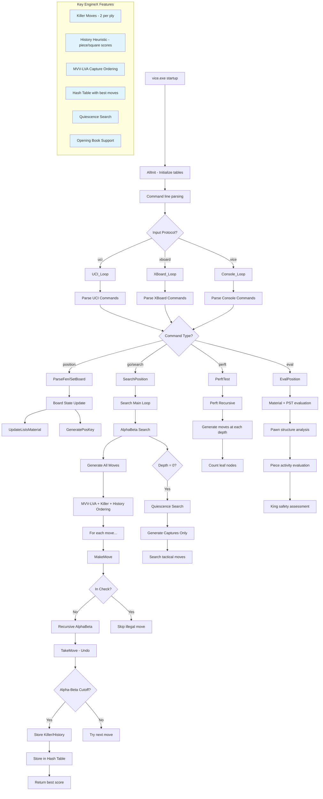
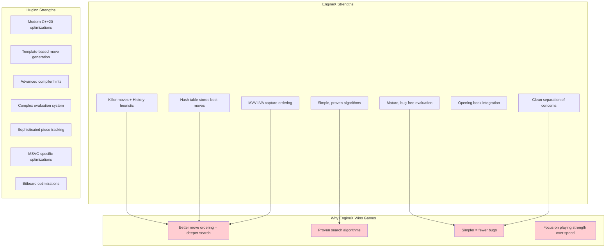

# EngineX (Vice) Chess Engine - UML Architecture Diagram

```mermaid
classDiagram
    %% Core Data Structures
    class S_BOARD {
        +int pieces[120]
        +U64 pawns[3]
        +int KingSq[2]
        +int side
        +int enPas
        +int fiftyMove
        +int ply
        +int hisPly
        +int castlePerm
        +U64 posKey
        +int pceNum[13]
        +int bigPce[2]
        +int majPce[2]
        +int minPce[2]
        +int material[2]
        +S_UNDO history[MAXGAMEMOVES]
        +int pList[13][10]
        +S_HASHTABLE HashTable[1]
        +int PvArray[MAXDEPTH]
        +int searchHistory[13][120]
        +int searchKillers[2][MAXDEPTH]
    }

    class S_MOVE {
        +int move
        +int score
    }

    class S_MOVELIST {
        +S_MOVE moves[MAXPOSITIONMOVES]
        +int count
    }

    class S_UNDO {
        +int move
        +int castlePerm
        +int enPas
        +int fiftyMove
        +U64 posKey
    }

    class S_HASHENTRY {
        +U64 posKey
        +int move
        +int score
        +int depth
        +int flags
    }

    class S_HASHTABLE {
        +S_HASHENTRY* pTable
        +int numEntries
        +int newWrite
        +int overWrite
        +int hit
        +int cut
    }

    class S_SEARCHINFO {
        +int starttime
        +int stoptime
        +int depth
        +int timeset
        +int movestogo
        +long nodes
        +int quit
        +int stopped
        +float fh
        +float fhf
        +int nullCut
        +int GAME_MODE
        +int POST_THINKING
    }

    %% Core Engine Modules
    class Vice_Main {
        +main()
        +AllInit()
        -processCommandLine()
        -mainLoop()
    }

    class Board_Module {
        +ResetBoard()
        +ParseFen()
        +PrintBoard()
        +UpdateListsMaterial()
        +CheckBoard()
        +MirrorBoard()
    }

    class MoveGen_Module {
        +GenerateAllMoves()
        +GenerateAllCaps()
        +MoveExists()
        +InitMvvLva()
        -AddQuietMove()
        -AddCaptureMove()
        -AddEnPassantMove()
        -AddWhitePawnCapMove()
        -AddBlackPawnCapMove()
        -AddWhitePawnMove()
        -AddBlackPawnMove()
    }

    class MakeMove_Module {
        +MakeMove()
        +TakeMove()
        +MakeNullMove()
        +TakeNullMove()
        -ClearPiece()
        -AddPiece()
        -MovePiece()
    }

    class Search_Module {
        +SearchPosition()
        +AlphaBeta()
        +Quiescence()
        -CheckUp()
        -PickNextMove()
        -IsRepetition()
        -ClearForSearch()
    }

    class Evaluate_Module {
        +EvalPosition()
        +MaterialDraw()
        -EvalPawns()
        -EvalPieces()
        -EvalKing()
        -GetPawnPassed()
        -GetPawnIsolated()
    }

    class Attack_Module {
        +SqAttacked()
        -PceAttacksKn()
        -PceAttacksKi()
        -PceAttacksRQ()
        -PceAttacksBQ()
    }

    class Hash_Module {
        +InitHashTable()
        +StoreHashEntry()
        +ProbeHashEntry()
        +ProbePvMove()
        +GetPvLine()
        +ClearHashTable()
        +GeneratePosKey()
    }

    class Bitboard_Module {
        +PrintBitBoard()
        +PopBit()
        +CountBits()
    }

    class IO_Module {
        +PrMove()
        +PrSq()
        +PrintMoveList()
        +ParseMove()
    }

    class UCI_Module {
        +Uci_Loop()
        -ParseGo()
        -ParsePosition()
        -ParseMove()
    }

    class XBoard_Module {
        +XBoard_Loop()
        +Console_Loop()
        -checkresult()
    }

    class Perft_Module {
        +PerftTest()
        +Perft()
    }

    class PolyBook_Module {
        +GetBookMove()
        +CleanPolyBook()
        +InitPolyBook()
    }

    %% Relationships
    S_BOARD ||--o{ S_MOVE : contains
    S_BOARD ||--o{ S_UNDO : history
    S_BOARD ||--|| S_HASHTABLE : has
    S_HASHTABLE ||--o{ S_HASHENTRY : contains
    S_MOVELIST ||--o{ S_MOVE : contains

    Vice_Main --> Board_Module : initializes
    Vice_Main --> UCI_Module : "uci mode"
    Vice_Main --> XBoard_Module : "xboard/console mode"
    
    UCI_Module --> Search_Module : search commands
    XBoard_Module --> Search_Module : search commands
    
    Search_Module --> MoveGen_Module : generate moves
    Search_Module --> MakeMove_Module : make/unmake moves
    Search_Module --> Evaluate_Module : position evaluation
    Search_Module --> Hash_Module : transposition table
    Search_Module --> Attack_Module : check detection
    
    MoveGen_Module --> Attack_Module : check legal moves
    MoveGen_Module --> Board_Module : access position
    
    MakeMove_Module --> Board_Module : update position
    MakeMove_Module --> Hash_Module : update zobrist key
    
    Evaluate_Module --> Board_Module : read position
    Evaluate_Module --> Bitboard_Module : pawn structure
    
    Board_Module --> Hash_Module : position hashing
    Board_Module --> IO_Module : display/input
    
    Perft_Module --> MoveGen_Module : test move generation
    Perft_Module --> MakeMove_Module : test make/unmake
    
    PolyBook_Module --> Board_Module : position lookup

    %% Data Flow Notes
    note for S_BOARD "Central game state with piece lists,\nbitboards, and search data"
    note for Search_Module "Alpha-beta with killer moves,\nhistory heuristic, and hash table"
    note for MoveGen_Module "Direction-based move generation\nwith MVV-LVA ordering"
    note for Hash_Module "Zobrist hashing with move,\nscore, depth, and bounds"
```

## EngineX Architecture Flow Diagram



## Key Differences from Huginn


