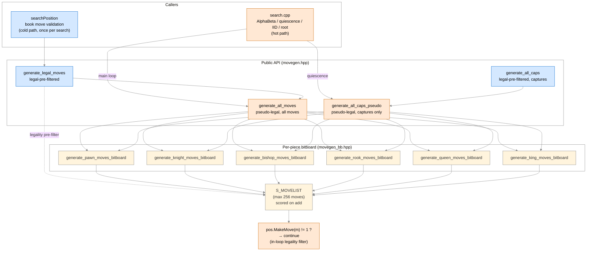
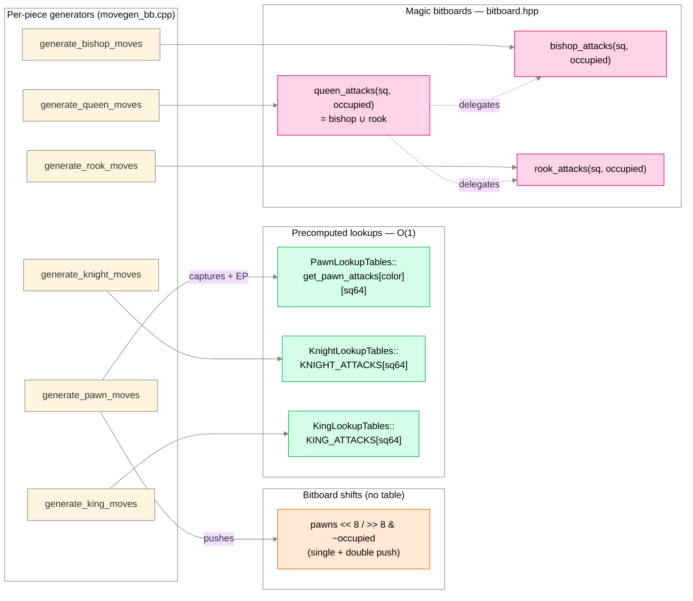
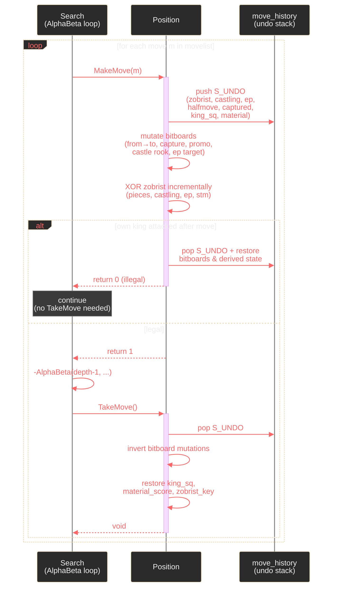

# Position Representation & Move Generation Architecture

This document describes how Huginn represents board state and
generates moves. Trust the code if it disagrees with this prose —
[`src/position.hpp`](../src/position.hpp), [`src/movegen.hpp`](../src/movegen.hpp),
[`src/movegen_bb.hpp`](../src/movegen_bb.hpp), and [`src/move.hpp`](../src/move.hpp)
are the authoritative sources.

## Overview

Huginn is **bitboard-primary**. The `Position` struct stores piece
locations as 64-bit bitboards (one per piece type per color, plus
aggregates). The 10×12 mailbox-120 *indexing scheme* is still used
for square coordinates (offsets, king location, en-passant target),
but there is no longer a `board[120]` piece array — `Position::at(sq)`
derives the piece from the bitboards on demand.

Per-color piece *lists* (`pList`/`pCount`) have been removed; iteration
is via bitboard pop-LSB loops.

## 120-square indexing

Squares are addressed in a 10×12 grid with a sentinel border. Playable
squares are `[21..98]` with file/rank constraints; sentinels return
`Piece::Offboard`. This indexing is convenient for direction-offset
arithmetic in code that pre-dates the bitboard layer (king-square
tracking, en-passant target, sliding-piece direction tables).

### Full 10×12 layout with sentinels

```
       File A   B   C   D   E   F   G   H
       ┌────────────────────────────────────┐
   .   │   0   1   2   3   4   5   6   7   8   9  │  sentinel row
   .   │  10  11  12  13  14  15  16  17  18  19  │  sentinel row
Rank 1 │  20  21  22  23  24  25  26  27  28  29  │  21..28 playable
Rank 2 │  30  31  32  33  34  35  36  37  38  39  │
Rank 3 │  40  41  42  43  44  45  46  47  48  49  │
Rank 4 │  50  51  52  53  54  55  56  57  58  59  │
Rank 5 │  60  61  62  63  64  65  66  67  68  69  │
Rank 6 │  70  71  72  73  74  75  76  77  78  79  │
Rank 7 │  80  81  82  83  84  85  86  87  88  89  │
Rank 8 │  90  91  92  93  94  95  96  97  98  99  │  91..98 playable
   .   │ 100 101 102 103 104 105 106 107 108 109  │  sentinel row
   .   │ 110 111 112 113 114 115 116 117 118 119  │  sentinel row
       └────────────────────────────────────┘
         ^                              ^
         file-A sentinel column        file-H sentinel column
         (index % 10 == 0)             (index % 10 == 9)
```

The sentinel border is what lets sliding-piece direction-offset code
walk a ray until it hits `Piece::Offboard` rather than masking each
step against file/rank bounds.

### Combined sq120 / sq64 view (playable squares only)

Each cell shows `120-index / 64-index`. Both numberings grow
northward (A1 → A8) and eastward (A1 → H1), so the conversion is
pure modular arithmetic.

| | A | B | C | D | E | F | G | H |
|---|---|---|---|---|---|---|---|---|
| **8** | 91/56 | 92/57 | 93/58 | 94/59 | 95/60 | 96/61 | 97/62 | 98/63 |
| **7** | 81/48 | 82/49 | 83/50 | 84/51 | 85/52 | 86/53 | 87/54 | 88/55 |
| **6** | 71/40 | 72/41 | 73/42 | 74/43 | 75/44 | 76/45 | 77/46 | 78/47 |
| **5** | 61/32 | 62/33 | 63/34 | 64/35 | 65/36 | 66/37 | 67/38 | 68/39 |
| **4** | 51/24 | 52/25 | 53/26 | 54/27 | 55/28 | 56/29 | 57/30 | 58/31 |
| **3** | 41/16 | 42/17 | 43/18 | 44/19 | 45/20 | 46/21 | 47/22 | 48/23 |
| **2** | 31/8  | 32/9  | 33/10 | 34/11 | 35/12 | 36/13 | 37/14 | 38/15 |
| **1** | 21/0  | 22/1  | 23/2  | 24/3  | 25/4  | 26/5  | 27/6  | 28/7  |

Conversion formulas (the `MAILBOX_MAPS` table is just a precomputed
projection of these):

```
file = (sq120 - 21) % 10  =  sq64 % 8        // 0..7
rank = (sq120 - 21) / 10  =  sq64 / 8        // 0..7
sq64  =  rank * 8 + file
sq120 =  rank * 10 + file + 21               // playable iff sq64 ∈ [0, 64)
```

### Direction offsets (120-space)

```
NORTH = +10    SOUTH = -10    EAST = +1     WEST = -1
NE = +11       NW = +9        SE = -9       SW = -11
KNIGHT_DELTAS = ±21, ±19, ±12, ±8
```

Why these specific numbers: NORTH=+10 follows from rows being 10 wide
in the 120-grid (8 playable + 2 sentinel columns). Knight deltas
combine two NORTH/SOUTH offsets with one EAST/WEST offset
(e.g., `+21 = 2*NORTH + EAST`). In 64-space these offsets become
`±8`, `±1`, etc., but you lose the free off-board detection — hence
the 120-grid is still kept for ray-walking helpers.

The `MAILBOX_MAPS` table provides bidirectional 120 ↔ 64 conversion;
`Position::at(sq120)` uses it to project into `piece_bitboards`.

## Position struct

The state held by `Position` falls into four groups: source-of-truth
piece bitboards, incrementally-updated derived state, mailbox-domain
fields, and the undo stack. The diagram below highlights those groups
and the `Position ↔ S_UNDO ↔ S_MOVE` relationship that drives
make/take.

```mermaid
%%{init: {'theme':'base', 'themeVariables': {'lineColor':'#888888', 'primaryBorderColor':'#888888'}}}%%
classDiagram
    direction LR

    class Position {
        +Color side_to_move
        +int ep_square : mailbox-120
        +uint8_t castling_rights : bitmask
        +uint16_t halfmove_clock
        +uint16_t fullmove_number
        +int ply
        +array~int,2~ king_sq : mailbox-120, incremental
        +array~array~Bitboard,6~,2~ piece_bitboards : SOURCE OF TRUTH
        +array~Bitboard,2~ color_bitboards : derived
        +Bitboard occupied_bitboard : derived
        +uint64_t zobrist_key : incremental XOR
        +array~int,2~ material_score : incremental
        +vector~S_UNDO~ move_history : undo stack
        +MakeMove(S_MOVE) int
        +TakeMove() void
        +MakeNullMove() void
        +TakeNullMove() void
        +at(sq120) Piece
        +at_sq64(s64) Piece
    }

    class S_UNDO {
        +S_MOVE move
        +uint8_t castling_rights
        +int ep_square
        +uint16_t halfmove_clock
        +uint64_t zobrist_key
        +Piece captured
        +array~int,2~ king_sq_backup
        +array~int,2~ material_score_backup
    }

    class S_MOVE {
        +int move : 25-bit packed
        +int score : ordering tag
        +get_from() int
        +get_to() int
        +is_capture() bool
        +is_promotion() bool
        +is_en_passant() bool
        +is_castle() bool
        +get_captured() PieceType
        +get_promoted() PieceType
    }

    Position "1" o-- "0..*" S_UNDO : move_history
    S_UNDO "1" *-- "1" S_MOVE : embeds

    note for Position "Source of truth: piece_bitboards only.\ncolor_bitboards + occupied_bitboard are derived\naggregates kept in sync inside add/clear/move_piece.\nking_sq, material_score, zobrist_key are incrementally\nupdated alongside the bitboards (not derivable in O(1))."
    note for S_UNDO "Pushed in MakeMove, popped in TakeMove.\nHolds everything needed to roll back state\nthat isn't trivially recomputable from the\nbitboards after a move."
```



For the literal layout (canonical reference):

```cpp
class Position {
public:
    Color side_to_move{Color::White};
    int ep_square{-1};                              // mailbox-120 or -1
    uint8_t castling_rights{0};                     // CASTLE_WK|WQ|BK|BQ
    uint16_t halfmove_clock{0};
    uint16_t fullmove_number{1};
    std::array<int, 2> king_sq{-1, -1};             // mailbox-120

    // Source of truth for piece locations:
    std::array<std::array<Bitboard, int(PieceType::_Count)>, 2> piece_bitboards{};
    std::array<Bitboard, 2> color_bitboards{0, 0};  // [White, Black] all pieces
    Bitboard occupied_bitboard{0};                  // White | Black

    uint64_t zobrist_key{0};
    std::array<int, 2> material_score{0, 0};
    std::vector<S_UNDO> move_history;
    int ply{0};

    // Public API
    int  MakeMove(const S_MOVE&);   // returns 1 on success, 0 on illegal
    void TakeMove();
    void MakeNullMove();
    void TakeNullMove();
    Piece at(int sq120) const;      // derived from piece_bitboards
    // ...
};
```

Note that `MakeMove` returns 0 when a pseudo-legal move turns out to
be illegal (king-into-check, pinned piece, EP self-check); callers
in the search use `if (pos.MakeMove(m) != 1) continue;` as the
per-move legality filter rather than pre-filtering at generation
time. See BACKLOG #14 for the rationale.

## Move encoding (S_MOVE)

Moves are 25 bits packed into a 32-bit `int`, plus a separate
`int score` for ordering. See [`src/move.hpp`](../src/move.hpp).

```
Bits  0-6:  From square (mailbox-120)
Bits  7-13: To square (mailbox-120)
Bits 14-17: Captured piece type
Bit  18:    En passant capture flag
Bit  19:    Pawn double-push flag
Bits 20-23: Promoted piece type
Bit  24:    Castle flag
```

Helper accessors: `m.get_from()`, `m.get_to()`, `m.is_capture()`,
`m.is_promotion()`, `m.is_en_passant()`, `m.is_castle()`,
`m.get_captured()`, `m.get_promoted()`.

`S_MOVELIST` is a fixed-size array (max 256 moves) with a `count`
and per-add helpers that auto-score for ordering.

## Move generation pipeline

Two layers, with hot-path callers going through pseudo-legal
generation + inline legality filtering via `MakeMove`, and cold-path
callers (book move validation) using the wrapper that pre-filters.



**Key flow facts:**

- The search calls **pseudo-legal** generators (`generate_all_moves`,
  `generate_all_caps_pseudo`) and uses `if (pos.MakeMove(m) != 1)
  continue;` as the per-move legality filter. This was a **+41% NPS
  win** at depth 11 startpos versus the older legal-pre-filter
  approach (BACKLOG #14, commit `b1154c8`).
- `generate_legal_moves` and `generate_all_caps` still exist for
  cold-path callers (book move validation in `searchPosition`).
  They wrap the pseudo-legal generators and pay the MakeMove/TakeMove
  cost up-front to return only legal moves; fine for one-shot use.
- All six per-piece generators write into the same `S_MOVELIST`.
  The add-helpers (`add_quiet_move`, `add_capture_move`,
  `add_promotion_move`, `add_en_passant_move`) tag each move with
  an ordering score at insertion time (see "Move ordering" below).
- Attack-set sources for each generator are broken down in
  **"Attack set sources"** below — three strategies (shifts, precomputed
  lookups, magic bitboards) with the cost gradient that implies.

## Attack set sources

Each per-piece generator gets its attack set from one of three sources.
The colors below also rank the cost gradient: shifts < lookup < magic.



**Notes:**

- **Pawn is the only piece using two sources.** Pushes are pure bit
  shifts (`<<8` / `>>8` masked against `~occupied`); captures and EP
  use a small precomputed table because the attack pattern depends on
  side-to-move (asymmetric diagonals) which shifts can't express
  generically.
- **Knight and king are precomputed tables** because their attack sets
  are fixed per-square — no occupancy dependence — so a 64-entry array
  is the cheapest possible source (one indexed load).
- **Sliders use magic bitboards** because their attack sets *do* depend
  on the full occupancy bitboard; magic multiplication + a perfect-hash
  table lookup is the standard fast-path. Queen is just `bishop | rook`,
  not a separate table.
- **Lookup tables are computed once at startup** (see
  [`src/attack_tables.cpp`](../src/attack_tables.cpp) and the
  `*_lookup_tables.cpp` files); the magic tables are also generated at
  startup from precomputed magic numbers.

## Make/Take protocol

```cpp
if (pos.MakeMove(move) != 1) continue;     // illegal — already restored
// ... search recurses with new state ...
pos.TakeMove();                            // restore prior state
```

The caller-side loop, the asymmetric rollback (illegal moves restore
themselves inside `MakeMove`; legal moves are paired with `TakeMove`),
and the per-step state mutations look like this:



In prose:

`MakeMove`:
1. Saves derived state (king_sq, material_score, zobrist) in `S_UNDO`.
2. Applies bitboard mutations (clear from-bit, set to-bit; capture
   and promotion bookkeeping; castling rook move; ep square handling).
3. Updates `zobrist_key` incrementally via XOR.
4. Tests if own king is now attacked. If so, restores from `S_UNDO`
   and returns 0; otherwise returns 1.

`TakeMove` pops the last `S_UNDO` and restores piece bitboards plus
derived state — O(1).

**Key invariant:** `TakeMove` is only called after `MakeMove` returned
1. An illegal pseudo-legal move (king-into-check) is fully rolled back
inside `MakeMove` itself before it returns 0 — pairing it with a
`TakeMove` would double-pop the undo stack.

`MakeNullMove` / `TakeNullMove` are used by null-move pruning; they
flip `side_to_move`, clear `ep_square`, and update zobrist without
touching pieces.

## Incremental updates

Two pieces of derived state are updated incrementally in `MakeMove`:

- **`king_sq`**: bumped when the moving piece is a king.
- **`material_score`**: adjusted on capture or promotion.

`zobrist_key` is also incrementally XOR'd in/out per move
(see `update_zobrist_for_move`).

The bitboards themselves are not "incremental" in the same sense —
each move directly mutates the source-of-truth bitboards; there's
no aggregate to keep in sync.

## Move ordering

Moves are scored at generation time so `pick_next_move` can do a
single-pass selection during search:

| Class | Score |
|---|---|
| TT move (when probed) | 3,000,000 |
| PV move | 2,000,000 |
| IID move | 1,500,000 |
| Captures | 1,000,000 + MVV-LVA |
| First killer | 900,000 |
| Second killer | 800,000 |
| Queen promotion | 90,000 |
| Rook/Bishop/Knight promotion | 50,000 / 33,000 / 32,000 |
| Other promotion | 25,000 |
| Counter-move | 15,000 *(currently gated off — see BACKLOG #15)* |
| History heuristic (quiet) | per-`[piece][to]` table |

See [`src/search.cpp`](../src/search.cpp) `pick_next_move`
for the authoritative ordering logic.

## Where to look

- Square indexing helpers: [`src/board120.hpp`](../src/board120.hpp).
- Bitboard primitives (set/clear/test, popcount, LSB): [`src/bitboard.hpp`](../src/bitboard.hpp)
  and [BITBOARD_IMPLEMENTATION.md](BITBOARD_IMPLEMENTATION.md).
- Attack tables (sliding rays, knight attacks, king attacks):
  [`src/attack_tables.cpp`](../src/attack_tables.cpp), [`src/attack_detection.cpp`](../src/attack_detection.cpp).
- Search and how it consumes the movegen API: [`src/search.cpp`](../src/search.cpp).
