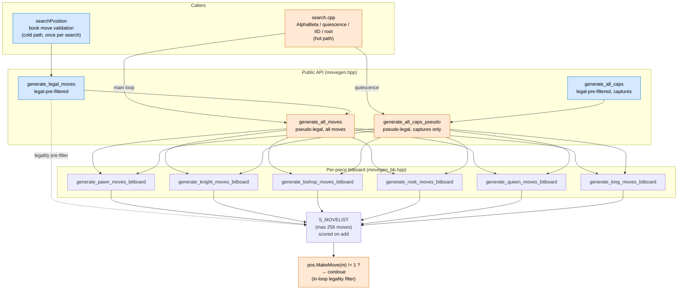

# Position Representation & Move Generation Architecture

This document describes how Huginn represents board state and
generates moves. Trust the code if it disagrees with this prose —
[`src/position.hpp`](../src/position.hpp), [`src/movegen.hpp`](../src/movegen.hpp),
[`src/movegen_bb.hpp`](../src/movegen_bb.hpp), and [`src/move.hpp`](../src/move.hpp)
are the authoritative sources.

## Overview

Huginn is **bitboard-primary**. The `Position` struct stores piece
locations as 64-bit bitboards (one per piece type per color, plus
aggregates). The 10×12 mailbox-120 *indexing scheme* is still used
for square coordinates (offsets, king location, en-passant target),
but there is no longer a `board[120]` piece array — `Position::at(sq)`
derives the piece from the bitboards on demand.

Per-color piece *lists* (`pList`/`pCount`) have been removed; iteration
is via bitboard pop-LSB loops.

## 120-square indexing

Squares are addressed in a 10×12 grid with a sentinel border. Playable
squares are `[21..98]` with file/rank constraints; sentinels return
`Piece::Offboard`. This indexing is convenient for direction-offset
arithmetic in code that pre-dates the bitboard layer (king-square
tracking, en-passant target, sliding-piece direction tables).

```
 21  22  23  24  25  26  27  28      Rank 1: A1=21, B1=22, ..., H1=28
 31  32  33  34  35  36  37  38      Rank 2
 ...                                  ...
 91  92  93  94  95  96  97  98      Rank 8: A8=91, ..., H8=98
```

Direction offsets:

```
NORTH = +10    SOUTH = -10    EAST = +1     WEST = -1
NE = +11       NW = +9        SE = -9       SW = -11
KNIGHT_DELTAS = ±21, ±19, ±12, ±8
```

The `MAILBOX_MAPS` table provides bidirectional 120 ↔ 64 conversion;
`Position::at(sq120)` uses it to project into `piece_bitboards`.

## Position struct

```cpp
class Position {
public:
    Color side_to_move{Color::White};
    int ep_square{-1};                              // mailbox-120 or -1
    uint8_t castling_rights{0};                     // CASTLE_WK|WQ|BK|BQ
    uint16_t halfmove_clock{0};
    uint16_t fullmove_number{1};
    std::array<int, 2> king_sq{-1, -1};             // mailbox-120

    // Source of truth for piece locations:
    std::array<std::array<Bitboard, int(PieceType::_Count)>, 2> piece_bitboards{};
    std::array<Bitboard, 2> color_bitboards{0, 0};  // [White, Black] all pieces
    Bitboard occupied_bitboard{0};                  // White | Black

    uint64_t zobrist_key{0};
    std::array<int, 2> material_score{0, 0};
    std::vector<S_UNDO> move_history;
    int ply{0};

    // Public API
    int  MakeMove(const S_MOVE&);   // returns 1 on success, 0 on illegal
    void TakeMove();
    void MakeNullMove();
    void TakeNullMove();
    Piece at(int sq120) const;      // derived from piece_bitboards
    // ...
};
```

Note that `MakeMove` returns 0 when a pseudo-legal move turns out to
be illegal (king-into-check, pinned piece, EP self-check); callers
in the search use `if (pos.MakeMove(m) != 1) continue;` as the
per-move legality filter rather than pre-filtering at generation
time. See BACKLOG #14 for the rationale.

## Move encoding (S_MOVE)

Moves are 25 bits packed into a 32-bit `int`, plus a separate
`int score` for ordering. See [`src/move.hpp`](../src/move.hpp).

```
Bits  0-6:  From square (mailbox-120)
Bits  7-13: To square (mailbox-120)
Bits 14-17: Captured piece type
Bit  18:    En passant capture flag
Bit  19:    Pawn double-push flag
Bits 20-23: Promoted piece type
Bit  24:    Castle flag
```

Helper accessors: `m.get_from()`, `m.get_to()`, `m.is_capture()`,
`m.is_promotion()`, `m.is_en_passant()`, `m.is_castle()`,
`m.get_captured()`, `m.get_promoted()`.

`S_MOVELIST` is a fixed-size array (max 256 moves) with a `count`
and per-add helpers that auto-score for ordering.

## Move generation pipeline

Two layers, with hot-path callers going through pseudo-legal
generation + inline legality filtering via `MakeMove`, and cold-path
callers (book move validation) using the wrapper that pre-filters.



**Key flow facts:**

- The search calls **pseudo-legal** generators (`generate_all_moves`,
  `generate_all_caps_pseudo`) and uses `if (pos.MakeMove(m) != 1)
  continue;` as the per-move legality filter. This was a **+41% NPS
  win** at depth 11 startpos versus the older legal-pre-filter
  approach (BACKLOG #14, commit `b1154c8`).
- `generate_legal_moves` and `generate_all_caps` still exist for
  cold-path callers (book move validation in `searchPosition`).
  They wrap the pseudo-legal generators and pay the MakeMove/TakeMove
  cost up-front to return only legal moves; fine for one-shot use.
- All six per-piece generators write into the same `S_MOVELIST`.
  The add-helpers (`add_quiet_move`, `add_capture_move`,
  `add_promotion_move`, `add_en_passant_move`) tag each move with
  an ordering score at insertion time (see "Move ordering" below).
- Attack tables backing the bitboard generators:
  - **Knight / King**: precomputed lookup tables ([`src/attack_tables.cpp`](../src/attack_tables.cpp))
  - **Pawn**: bitboard shift operations (no table)
  - **Bishop / Rook / Queen**: magic bitboards (Queen = Bishop ∪ Rook)

## Make/Take protocol

```cpp
if (pos.MakeMove(move) != 1) continue;     // illegal — already restored
// ... search recurses with new state ...
pos.TakeMove();                            // restore prior state
```

`MakeMove`:
1. Saves derived state (king_sq, material_score, zobrist) in `S_UNDO`.
2. Applies bitboard mutations (clear from-bit, set to-bit; capture
   and promotion bookkeeping; castling rook move; ep square handling).
3. Updates `zobrist_key` incrementally via XOR.
4. Tests if own king is now attacked. If so, restores from `S_UNDO`
   and returns 0; otherwise returns 1.

`TakeMove` pops the last `S_UNDO` and restores piece bitboards plus
derived state — O(1).

`MakeNullMove` / `TakeNullMove` are used by null-move pruning; they
flip `side_to_move`, clear `ep_square`, and update zobrist without
touching pieces.

## Incremental updates

Two pieces of derived state are updated incrementally in `MakeMove`:

- **`king_sq`**: bumped when the moving piece is a king.
- **`material_score`**: adjusted on capture or promotion.

`zobrist_key` is also incrementally XOR'd in/out per move
(see `update_zobrist_for_move`).

The bitboards themselves are not "incremental" in the same sense —
each move directly mutates the source-of-truth bitboards; there's
no aggregate to keep in sync.

## Move ordering

Moves are scored at generation time so `pick_next_move` can do a
single-pass selection during search:

| Class | Score |
|---|---|
| TT move (when probed) | 3,000,000 |
| PV move | 2,000,000 |
| IID move | 1,500,000 |
| Captures | 1,000,000 + MVV-LVA |
| First killer | 900,000 |
| Second killer | 800,000 |
| Queen promotion | 90,000 |
| Rook/Bishop/Knight promotion | 50,000 / 33,000 / 32,000 |
| Other promotion | 25,000 |
| Counter-move | 15,000 *(currently gated off — see BACKLOG #15)* |
| History heuristic (quiet) | per-`[piece][to]` table |

See [`src/search.cpp`](../src/search.cpp) `pick_next_move`
for the authoritative ordering logic.

## Where to look

- Square indexing helpers: [`src/board120.hpp`](../src/board120.hpp).
- Bitboard primitives (set/clear/test, popcount, LSB): [`src/bitboard.hpp`](../src/bitboard.hpp)
  and [BITBOARD_IMPLEMENTATION.md](BITBOARD_IMPLEMENTATION.md).
- Attack tables (sliding rays, knight attacks, king attacks):
  [`src/attack_tables.cpp`](../src/attack_tables.cpp), [`src/attack_detection.cpp`](../src/attack_detection.cpp).
- Search and how it consumes the movegen API: [`src/search.cpp`](../src/search.cpp).
