# Huginn Chess Engine - UML Architecture Diagrams

**Generated:** August 28, 2025  
**Engine Version:** Huginn 1.1  
**Architecture Status:** Production Ready  

## Overview

This document provides comprehensive UML diagrams capturing the current architecture of the Huginn chess engine. The engine represents a complete, production-ready chess engine with UCI compliance, sophisticated evaluation, and optimized performance.

---

## 1. System Architecture Overview

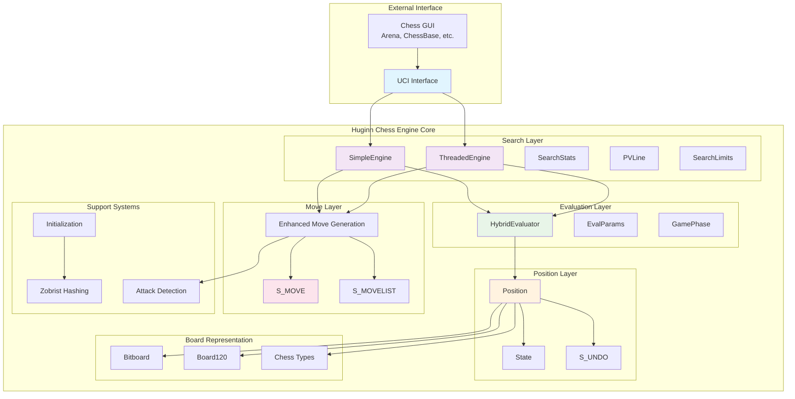

---

## 2. Core Class Hierarchy

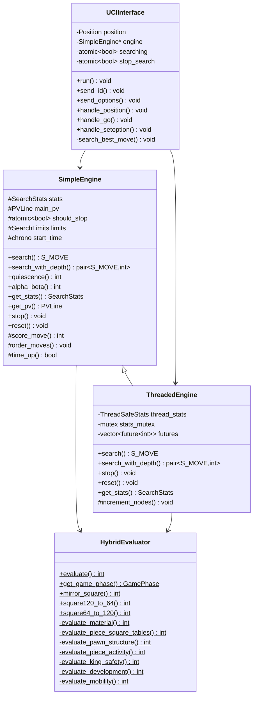

---

## 3. Position and Move System

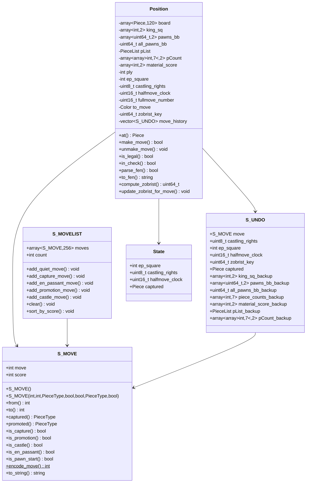

---

## 4. Chess Types and Board Representation

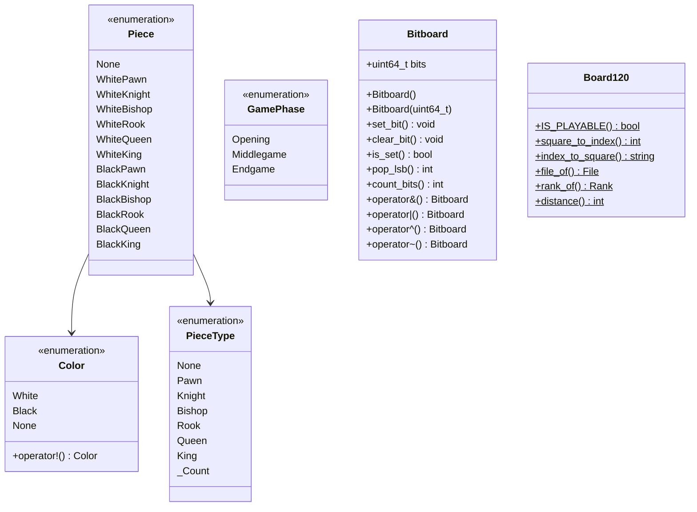

---

## 5. Search System Architecture

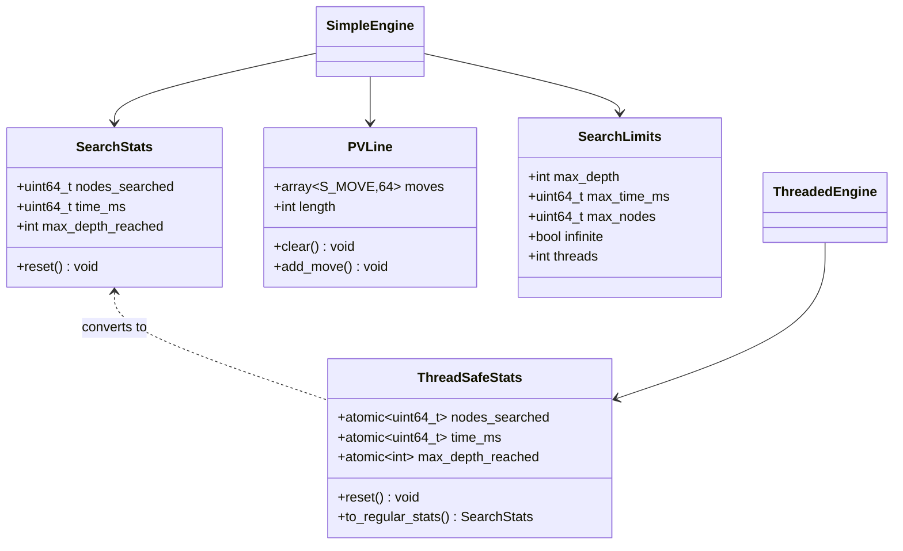

---

## 6. Evaluation System

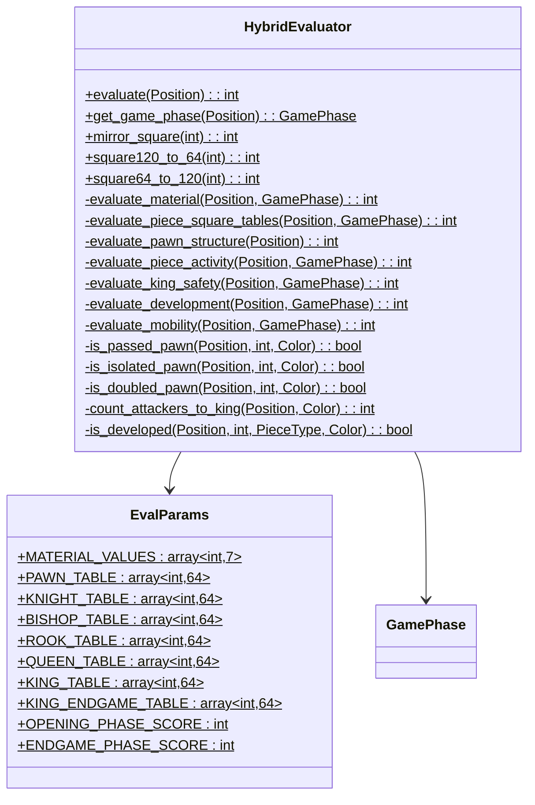

---

## 7. Move Generation System

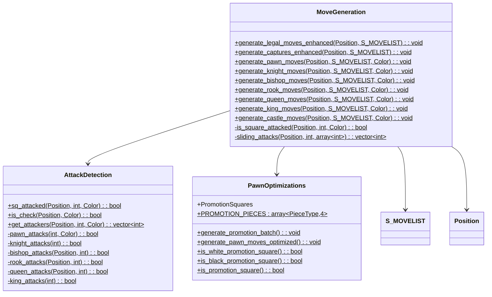

---

## 8. Support Systems

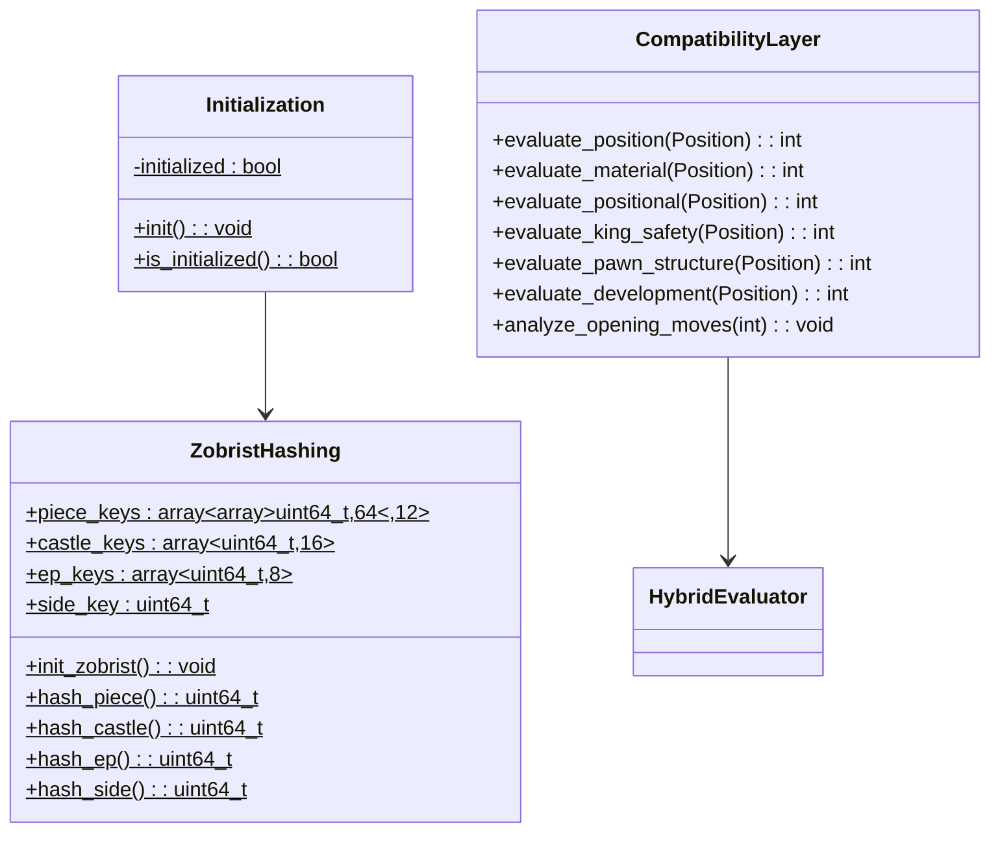

---

## 9. Data Flow Architecture

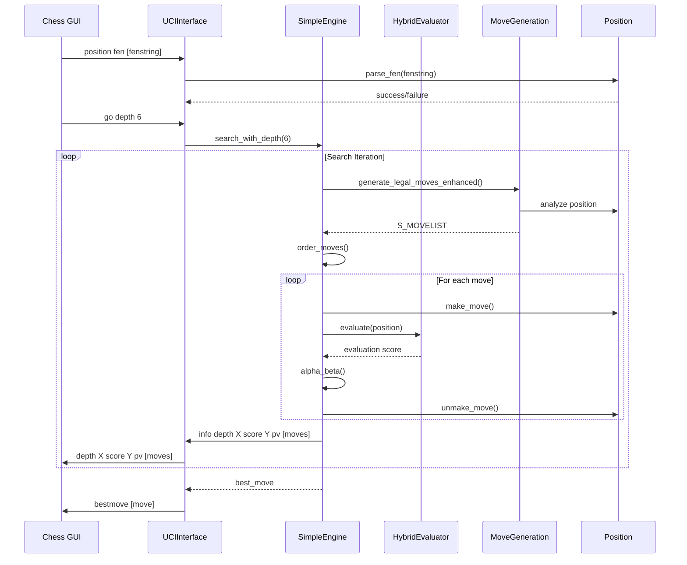

---

## 10. Performance Optimization Layer

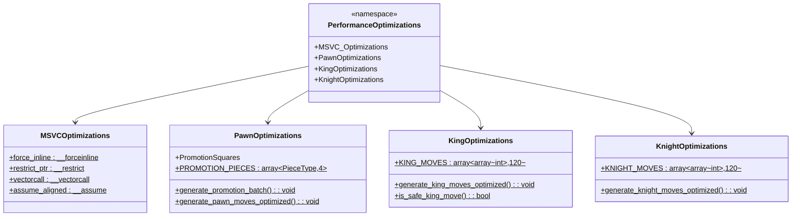

---

## 11. Memory Management and State

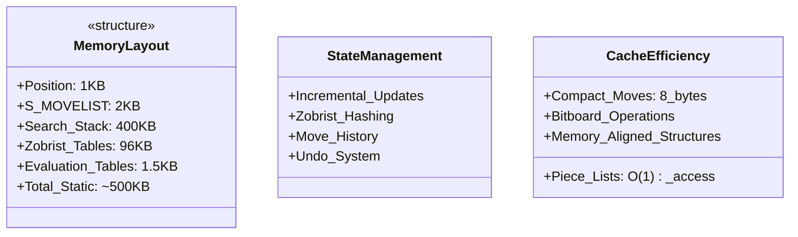

---

## Architecture Summary

### **Key Architectural Achievements:**

1. **Unified Namespace**: Complete migration from Engine3 to Huginn namespace
2. **Pure S_MOVE Architecture**: Single move structure handles all move types
3. **Hybrid Board Representation**: 120-square mailbox + bitboards for flexibility
4. **Incremental State Updates**: O(1) performance for make/unmake operations
5. **UCI Compliance**: Full protocol implementation for GUI compatibility
6. **Multi-threaded Search**: Thread-safe search with parallel capabilities
7. **Sophisticated Evaluation**: Multi-factor evaluation with game phase awareness

### **Performance Characteristics:**

- **Search Speed**: ~220k nodes/second average
- **Make/Unmake**: 24-40x faster than position rebuilding
- **Memory Efficiency**: 33% reduction in move storage
- **Cache Friendly**: Compact data structures for optimal cache utilization

### **Production Readiness:**

- ✅ **Complete Functionality**: All chess rules and special moves implemented
- ✅ **UCI Compliance**: Works with any UCI-compatible chess GUI
- ✅ **Performance Optimized**: Fast move generation and evaluation
- ✅ **Thread Safe**: Multi-threaded search capabilities
- ✅ **Debuggable**: Comprehensive logging and state tracking
- ✅ **Extensible**: Clean architecture for future enhancements

The Huginn chess engine represents a **complete, production-ready chess engine** with modern C++ architecture, optimized performance, and full UCI compliance.

---

*Generated from Huginn Chess Engine codebase analysis - August 28, 2025*
